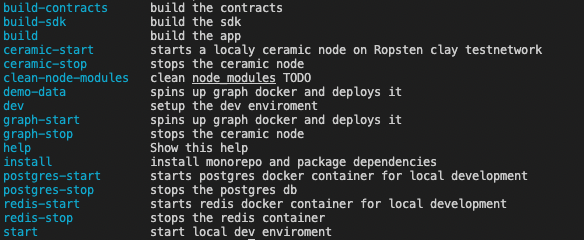

## Development requirements

- [docker](https://docs.docker.com/get-docker/)
- [pnpm](https://pnpm.io/installation) 
- [make](https://opensource.com/article/18/8/what-how-makefile) (get started with makefile [mac](https://formulae.brew.sh/formula/make), [win](https://stackoverflow.com/questions/32127524/how-to-install-and-use-make-in-windows) )
- [Docker Compose](https://www.digitalocean.com/community/tutorials/how-to-install-and-use-docker-compose-on-ubuntu-20-04)

## Getting started

Run `make dev`

To delete and clear all instances and data run `make clean`
## Development
Choose either vs **👩‍💻 With tasks in VSCode (preferred)** or **💻 With make**
### 👩‍💻 With tasks in VSCode (preferred) 
In VScode, run task `dev`  ( ⇧⌘B workbench.action.tasks.runTask). 

This will fire up all projects in watch mode so you can develop and experience imdiate results (hopefully across pacakges).
The graph takes some time to start. Once it is started it will keep running in docker as long as your captable contracts terminal is running.

### 💻 With make

Run `make start`, this will fire up all projects in watch mode so you can develop and experience imdiate results (hopefully across pacakges).

To run The Graph locally, open a new terminal and run `make graph-start`. This will fire up the docker image, which takes some time and deploys your current capTableRegistry. This requires `make start` to be running in the background, spesifically the hardhat node.


To see avaiable commands run `make`



## Deployment
- SDK [NPM](https://www.npmjs.com/package/@brok/sdk)
- Captable [NPM](https://www.npmjs.com/package/@brok/captable)
- Graph [HostedService](https://thegraph.com/hosted-service/dashboard) (connected to robertosnap account)
- demo-server [Heroku](https://brok-demo-server-dev.herokuapp.com/) 
- demo-frontend [Heroku](https://brok-demo-frontend-dev.herokuapp.com/)

So SDK and Captable are NPM packages that needs to be published for changes to propegate. 
Graph, demo-server and demo-frontend needs to be deployed to their enviroments to progegate changes.

```bash
build:captable
build                           - builds everything
build:sdk
deploy
deploy:destroy [env]            - Fulle destroys all deployed heroku apps for env
deploy:destroy:frontend
deploy:destroy:server
deploy:frontend [env]           - Deploys frontend to Heroku
deploy:graph [env]              - Deploys graph to Graph hosted services
deploy:logs:frontned
deploy:logs:server
deploy:server [env]             - Deploys server to Heroku
publish                         - publish packages with changes
```

### Examples
`pnpx task help` show available commands.

`pnpx task deploy dev` will deploy graph, demo-server and demo-frontend to their hosting enviroments for enviroment `dev`

`pnpx task deploy:server dev` will deploy graph to its hosting enviroments for enviroment `dev

`pnpx task publish` will publish packages wich changes (interactive) to NPM.


To be able to deploy to Heroku, NPN og The Ghrap hosted service you must have access. Request from admin.

## Enviroment variables

The main enviorment variables that you need to familirize with:
- An Etehreum RPC (We recommend [alchemyapi.io](https://dashboard.alchemyapi.io/) or [Infura](https://infura.io/))
- A ceramic node [https://ceramic.network/](https://ceramic.network/)
- An Ethereum secret (seed phrase). You can generate one with [Ethers](https://docs.ethers.io/v5/)
- The Graph API indexing captable contracts [thegraph.com](https://thegraph.com/en/)

### Enviroment setup
1. Get yourself an Ethereum RPC and Ethereum secret and put these into /.env and ./packages/captable/.env


## Ugly hacks
- If the blockchain node (running inside the captable contracts terminal) is killed, the graph node will stop indexing. To fire it up again run `make graph-stop` then `make graph-start`.
- Tasks that errors will continue to run. Should swap out task system for something that can handle errors in shell.
